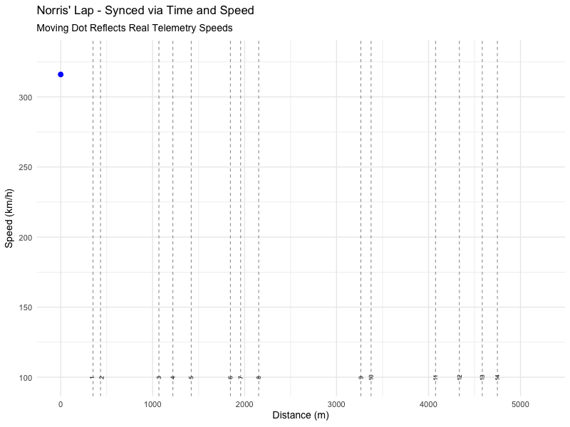

## Introduction

In this tutorial, we will build an animated speed trace of Lando Norris' fastest qualifying lap at the 2025 Australian Grand Prix. By the end, you will have a GIF that shows the car's speed evolving in real time across the circuit, synchronised with actual telemetry data.

Here is the onboard footage from that lap. Watch how speed changes through corners and straights, then we will recreate that pattern from raw data.

<video width="100%" controls>
  <source src="video.mp4" type="video/mp4">
  Your browser does not support the video tag.
</video>

We will work through seven steps: loading packages, fetching qualifying results, identifying the fastest lap, loading telemetry, adding circuit corner data, building a static plot layer by layer, and finally animating it.


## 1. Setup and Package Loading

We need six packages for this tutorial:

- **f1dataR** accesses the Formula 1 data API (powered by the FastF1 Python library)
- **dplyr** provides data manipulation verbs (`filter()`, `mutate()`, `select()`)
- **ggplot2** builds our static plot
- **gganimate** adds animation transitions to ggplot objects
- **gifski** renders the animation frames into a high-quality GIF
- **ggrepel** places text labels intelligently so they do not overlap

```{r}
#| label: setup

library(f1dataR)
library(dplyr)
library(ggplot2)
library(gganimate)
library(gifski)
library(ggrepel)
```


## 2. Load Qualifying Results

We start by loading the qualifying results for Round 1 of the 2025 season (the Australian Grand Prix). The `load_quali()` function returns a summary table with each driver's best times from Q1, Q2, and Q3.

```{r}
#| label: load-quali

quali_results <- load_quali(
  season = 2025,
  round  = 1
)

glimpse(quali_results)
```

Each row is one driver. Notice columns like `driver_id`, `position`, `q1`, `q2`, and `q3`, which contain their best lap time in each qualifying segment.


## 3. Filter for Norris' Best Lap

Next we load the detailed lap-by-lap data from the qualifying session and find which specific lap number was Norris' fastest. This is different from `load_quali()`, which only gives final results. `load_session_laps()` gives us every lap driven by every driver, including lap times and tyre information.

```{r}
#| label: find-best-lap

# Load all laps from qualifying
session_laps <- load_session_laps(
  season  = 2025,
  round   = 1,
  session = "Q"
)

# Filter to Norris and find his fastest lap
norris_best <- session_laps %>%
  filter(driver == "NOR") %>%
  slice_min(order_by = lap_time, n = 1, with_ties = FALSE) %>%
  select(driver, lap_number)

norris_best
```

The pipeline works as follows:

1. `filter(driver == "NOR")` keeps only Norris' laps
2. `slice_min(order_by = lap_time, n = 1)` selects the single lap with the smallest (fastest) lap time
3. `select(driver, lap_number)` extracts just the driver code and lap number we need


## 4. Load Telemetry Data

Now we fetch the high-frequency telemetry for that specific lap. This data contains measurements taken many times per second, including speed, throttle position, brake status, gear, and distance along the circuit.

```{r}
#| label: load-telemetry

norris_telemetry <- load_driver_telemetry(
  season  = 2025,
  round   = 1,
  session = "Q",
  driver  = norris_best$driver,
  laps    = norris_best$lap_number
)

glimpse(norris_telemetry)
```

Key columns we will use:

- **distance**: metres travelled from the start/finish line
- **speed**: car speed in km/h
- **time**: elapsed time in seconds from the start of the lap


## 5. Load Circuit Corner Data

To add context to the speed trace, we overlay vertical lines showing where each corner is on the circuit. The `load_circuit_details()` function returns corner positions (as distances along the track), marshal light locations, and other track features.

We use the 2024 season (Round 3) because the Melbourne circuit layout is the same and the corner data is reliably available for that round.

```{r}
#| label: load-corners

circuit_info <- load_circuit_details(
  season    = 2024,
  round     = 3,
  log_level = "WARNING"
)

corners_df <- circuit_info$corners

# Create a label for each corner (e.g. "1", "4A", "11B")
corners_df <- corners_df %>%
  mutate(
    corner_label = ifelse(
      letter == "",
      as.character(number),
      paste0(number, letter)
    )
  )

glimpse(corners_df)
```

Each row represents a corner on the circuit. The `distance` column tells us how far along the lap (in metres) each corner occurs, which we will use to position vertical marker lines on the plot.


## 6. Build the Static Plot

Rather than writing the entire plot at once, we will build it layer by layer so you can see what each component adds.

### 6.1 Speed trace line

We start with the basic speed trace: a line showing speed (y-axis) against distance travelled (x-axis).

```{r}
#| label: plot-line

ggplot(norris_telemetry, aes(x = distance, y = speed)) +
  geom_line(linewidth = 1, colour = "blue") +
  theme_minimal(base_size = 14)
```

### 6.2 Add data points

Adding points makes individual telemetry readings visible and will become the "moving dot" in the animation later.

```{r}
#| label: plot-points

ggplot(norris_telemetry, aes(x = distance, y = speed)) +
  geom_line(linewidth = 1, colour = "blue") +
  geom_point(size = 3, colour = "blue") +
  theme_minimal(base_size = 14)
```

### 6.3 Add corner markers

Vertical dashed lines show where each corner begins. This helps connect the speed dips and peaks to specific parts of the circuit.

```{r}
#| label: plot-corners

ggplot(norris_telemetry, aes(x = distance, y = speed)) +
  geom_line(linewidth = 1, colour = "blue") +
  geom_point(size = 3, colour = "blue") +
  geom_vline(
    data     = corners_df,
    aes(xintercept = distance),
    colour   = "grey40",
    linetype = "dashed",
    alpha    = 0.7
  ) +
  theme_minimal(base_size = 14)
```

### 6.4 Add corner labels

We use `geom_text_repel()` from the ggrepel package to place corner numbers near the vertical lines without overlapping each other.

```{r}
#| label: plot-labels

ggplot(norris_telemetry, aes(x = distance, y = speed)) +
  geom_line(linewidth = 1, colour = "blue") +
  geom_point(size = 3, colour = "blue") +
  geom_vline(
    data     = corners_df,
    aes(xintercept = distance),
    colour   = "grey40",
    linetype = "dashed",
    alpha    = 0.7
  ) +
  geom_text_repel(
    data            = corners_df,
    aes(x = distance, y = 90, label = corner_label),
    colour          = "black",
    angle           = 90,
    size            = 3,
    nudge_y         = 10,
    segment.colour  = "transparent"
  ) +
  theme_minimal(base_size = 14)
```

### 6.5 Add titles and finalise

Finally, we add descriptive labels so the plot communicates its content clearly.

```{r}
#| label: plot-final

static_plot <- ggplot(norris_telemetry, aes(x = distance, y = speed)) +
  geom_line(linewidth = 1, colour = "blue") +
  geom_point(size = 3, colour = "blue") +
  geom_vline(
    data     = corners_df,
    aes(xintercept = distance),
    colour   = "grey40",
    linetype = "dashed",
    alpha    = 0.7
  ) +
  geom_text_repel(
    data            = corners_df,
    aes(x = distance, y = 90, label = corner_label),
    colour          = "black",
    angle           = 90,
    size            = 3,
    nudge_y         = 10,
    segment.colour  = "transparent"
  ) +
  labs(
    title    = "Norris' Pole Lap Speed Trace",
    subtitle = "2025 Australian Grand Prix Qualifying",
    x        = "Distance (m)",
    y        = "Speed (km/h)"
  ) +
  theme_minimal(base_size = 14)

static_plot
```

This is the complete static visualisation. You can see exactly where Norris brakes (speed drops) and accelerates (speed rises) through each section of the Melbourne circuit.


## 7. Animate with gganimate

Now we bring the plot to life. The `transition_reveal()` function from gganimate progressively draws the line and point based on a variable, in our case the `time` column. This means the dot moves at the actual speed from the telemetry data, matching real lap timing.

First, we calculate how many frames the animation needs. We match the animation duration to the actual lap duration so the playback speed is realistic.

```{r}
#| label: animate
#| eval: false

# Calculate animation parameters from actual lap duration
lap_duration <- max(norris_telemetry$time, na.rm = TRUE)
fps          <- 10
nframes      <- round(lap_duration * fps)

# Add animation to the static plot
animated_plot <- static_plot +
  transition_reveal(along = time) +
  ease_aes("linear")

# Render the animation
norris_anim <- animate(
  animated_plot,
  nframes  = nframes,
  fps      = fps,
  width    = 800,
  height   = 600,
  renderer = gifski_renderer()
)

# Display the animation
norris_anim

# Save to file
# anim_save("norris_lap_animation.gif", animation = norris_anim)
```

To generate the animation yourself, run the chunk above interactively in RStudio/Positron. The GIF takes several minutes to render due to the large number of frames. Here is the pre-rendered result:



The key parameters:

- **`transition_reveal(along = time)`** tells gganimate to reveal the plot progressively, using the `time` column to control pacing
- **`ease_aes("linear")`** ensures smooth, constant interpolation between data points
- **`nframes`** is calculated as `lap_duration * fps` so the animation runs for the same duration as the real lap
- **`gifski_renderer()`** produces a high-quality GIF


## Summary

In this tutorial, we covered:

1. **Accessing F1 data** using the f1dataR package to pull qualifying results, session laps, and detailed telemetry
2. **Data wrangling** with dplyr to filter for a specific driver and identify their fastest lap
3. **Layered visualisation** with ggplot2, building a plot incrementally with lines, points, corner markers, labels, and themes
4. **Animation** with gganimate and gifski, synchronising the animation to real telemetry timing

The same approach works for any driver, any session (practice, qualifying, race), and any season available through the F1 data API. Try changing the driver code, round number, or season to explore different laps.
